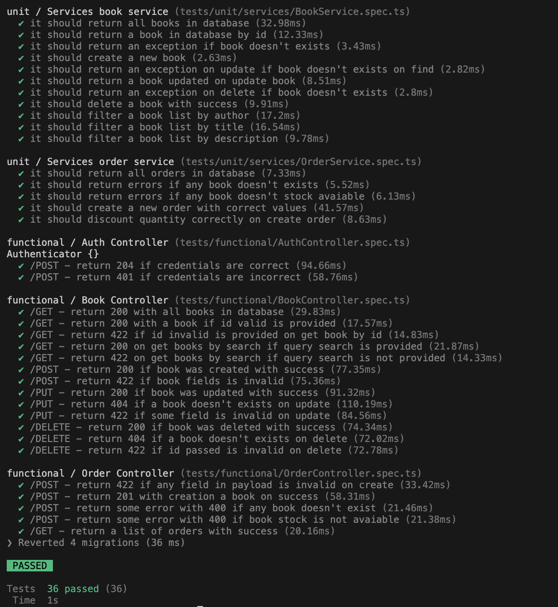

# Bookstore (Backend)

API desenvolvida que permite a criação, listagem, edição e exclusão de livros, além de poder criar e listar pedidos. A ideia central é fornecer uma API funcional que simule uma livraria online

## Tecnologias usadas

- AdonisJS (v6.18.0)
- PostgreSQL (v16)
- Lucid (ORM)
- Japa (testes)
- VineJS (validação de dados)
- Sinon (Mock e Fakes)
- Docker (v24.0.7)
- Node (> v20.17.0)
- c8 (criação de relatório de cobertura de teste)

## Sobre a arquitetura

A arquitetura adotada seguiu um modelo mais simples de arquitetura em 3 camadas (three-tier architecture), tendo um foco na criação dos recursos de acordo com as necessidades, sem adicionar complexidade extras para o projeto, e com um olhar maior nos testes unitários e de integração com o objetivo de atingir a maior cobertura possível


## Decisões Técnicas

- Foco maior em testes unitários e de integração
- Escolha de campo soft delete na exclusão de um livro, visto que, a exclusão de um livro poderia acarretar na remoção dos pedidos já vinculados
- Tratamento de exceções customizadas e seguindo o contexto de sua ação
- Adotei que o preço livro ficasse como múltiplo de 100, para evitar problemas de ponto flutuante

## Passos para execução

1. Clone o projeto

   ```bash
     git clone https://github.com/heitorvaldeger/bookstore
   ```

2. Acesse a pasta "bookstore/backend":

   ```bash
     cd bookstore/backend
   ```

3. Crie uma cópia do arquivo .env.example e renomeie para .env e .env.test:
   ```bash
     cp .env.example .env && cp .env.example .env.test
   ```

### Execução com o Docker

1. Preencha o arquivo .env com os seguintes valores:

   ```bash
     # Esses valores serão lidos assim que os containeres de banco e da API forem criados

     TZ=UTC
     PORT=8080
     HOST=api
     LOG_LEVEL=info
     APP_KEY=BeR9QdMBIhBri2H8zVhmkNKW3jK3fou5
     NODE_ENV=production
     DB_HOST=db
     DB_PORT=5432
     DB_USER="root"
     DB_PASSWORD="root"
     DB_DATABASE=bookstore
     SESSION_DRIVER=memory
   ```

- Após isso, execute o comando:

  ```bash
    # Será criado três containeres. O servidor será iniciado na porta escolhida no .env

    npm run up
  ```

- Será criada as credenciais automaticamente:
  ```bash
    email: mail@mail.com
    password: 1234
  ```

### Execução sem o docker

- Preencha o arquivo .env com os seguintes valores:

  ```bash
    # ⚠️ É necessário criar um banco de dados com o mesmo nome escolhido no .env
    # ⚠️ Informe as mesmas credenciais no .env do seu banco de dados

    TZ=UTC
    PORT=8080
    HOST=localhost
    LOG_LEVEL=info
    APP_KEY=
    NODE_ENV=development
    DB_HOST=127.0.0.1
    DB_PORT=5432
    DB_USER=
    DB_PASSWORD=
    DB_DATABASE=bookstore
    SESSION_DRIVER=memory
  ```

- Execute os comandos

  ```bash
    # Instala as dependências
    npm install

    # Gere a chave
    node ace generate:key

    # Executa as migrações
    node ace migration:run

    # Executa os seeders para o banco de dados
    node ace db:seed
  ```

- Será criada as credenciais automaticamente:

  ```bash
    email: mail@mail.com
    password: 1234
  ```

- Execute o servidor (ouvindo na porta escolhida no .env)
  ```bash
    node ace serve
  ```

## Executando os testes

⚠️ PS: Caso esteja utilizando o docker, na execução do comando **npm run up**, será criado um container chamado db-hom na porta 5433, esse container pode ser utilizado para a execução dos testes, seguindo as configurações corretas das variáveis de ambiente.

⚠️ PS: Não precisa executar as migrações para os testes, essa operação já será realizada automicamente, bem como o rollback, quando eles forem executados.

1. Crie uma cópia do arquivo .env.example:

   ```bash
    # Crie a cópia e renomeie (Caso não tenha feito)
    cp .env.example .env.test

    # Instala as dependências (Caso não tenha feito)
    npm install
   ```

2. Preencha o arquivo .env.test com os seguintes valores:

   ```bash
      # ⚠️ Atenção: Caso alguma variável seja "preenchida" como vazio, automaticamente o valor dessa variável será lida do .env

     TZ=UTC
     PORT=3333
     HOST=localhost
     LOG_LEVEL=info
     APP_KEY=
     NODE_ENV=test
     DB_HOST=127.0.0.1
     DB_PORT=5432
     DB_USER="root"
     DB_PASSWORD="root"
     DB_DATABASE=bookstore
     SESSION_DRIVER=memory
   ```

3. Execute os testes

   ```bash
     npm run test
   ```

   

## Documentação

A documentação foi elaborada utilizando o Postman e se encontra disponível em docs/

### Passos para reprodução

1. Importe o arquivo .json utilizando o Postman
2. Adicione uma variável de ambiente na collection "Bookstore - API" com o nome "url" e com o valor referente ao host e porta do servidor. Como no GIF abaixo
