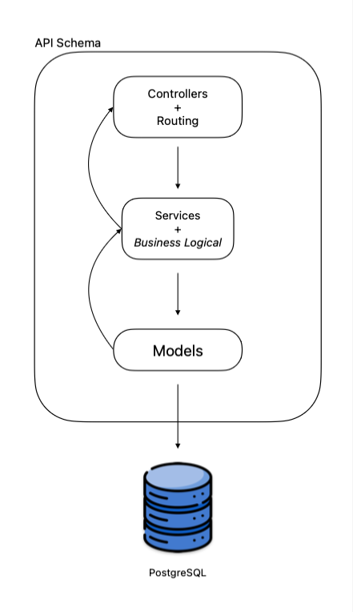

# Bookstore (Backend)

API desenvolvida que permite a criação, listagem, edição e exclusão de livros, além de poder criar e listar pedidos. A ideia central é fornecer uma API funcional que simule uma livraria online

## Tecnologias usadas
- AdonisJS
- PostgreSQL
- Lucid (ORM)
- Japa (testes)
- VineJS (validação de dados)
- Sinon (Mock e Fakes)
- Docker

## Sobre a arquitetura
A arquitetura adotada seguiu um modelo mais simples de arquitetura em 3 camadas (three-tier architecture), tendo um foco na criação dos recursos de acordo com as necessidades, sem adicionar complexidade extras para o projeto, e com um olhar maior nos testes unitários e de integração com o objetivo de atingir a maior cobertura possível



## Passos para execução

1. Clone o projeto
  ```bash
    git clone https://github.com/heitorvaldeger/bookstore
  ```

2. Acesse a pasta "bookstore":
  ```bash
    cd bookstore

    # Acesse a pasta "backend"
    cd backend
  ```

3. Crie uma cópia do arquivo .env.example e renomeie para .env:
  ```bash
    cp .env.example .env
  ```

4. Execução com o Docker
  - Preencha o arquivo .env com os seguintes valores:
    ```bash
      TZ=UTC
      PORT=8080
      HOST=api
      LOG_LEVEL=info
      APP_KEY=BeR9QdMBIhBri2H8zVhmkNKW3jK3fou5
      NODE_ENV=production
      DB_HOST=db
      DB_PORT=5432
      DB_USER="root"
      DB_PASSWORD="root"
      DB_DATABASE=bookstore
      SESSION_DRIVER=cookie

      # Esses valores serão lidos assim que os containeres de banco e da API forem criados
    ```

  - Após isso, execute o comando:
    ```bash
      docker-compose up

      # Serão criados três containeres:
      # - api
      # - db
      # - db-hom (banco de homologação)

      # Para acessar os endpoints, acesse o HOST https://localhost:8080
    ```

5. Execução sem o docker
  - Preencha o arquivo .env com os seguintes valores:
    ```bash
      # ⚠️ A versão utilizada do PostgreSQL para o projeto foi a 16
      # ⚠️ É necessário criar um banco de dados com o mesmo nome escolhido no .env
      # ⚠️ Informe as mesmas credenciais no .env do seu banco de dados

      TZ=UTC
      PORT=3333
      HOST=localhost
      LOG_LEVEL=info
      APP_KEY=BeR9QdMBIhBri2H8zVhmkNKW3jK3fou5
      NODE_ENV=development
      DB_HOST=127.0.0.1
      DB_PORT=5432
      DB_USER="root"
      DB_PASSWORD="root"
      DB_DATABASE=bookstore
      SESSION_DRIVER=cookie
    ```
  - Instale as dependências e execute as migrações:
    ```bash
      npm install
      node ace migration:run
    ```

  - Execute o servidor
    ```bash
      # O servidor será iniciado na porta escolhida no .env
      node ace serve
    ```